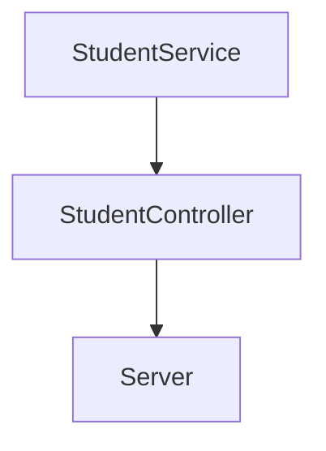

# Practice Launch X: Code challenge

The requirements of this code challenge are the next ones:
1. Enable an endpoint to get all students with all their fields.
2. Enable an endpoint to get the emails of all students who `haveCertification` is `true`.
3. Enable an endpoint to consult all students who have credits greater than 500.

The flow of this requirements are as follows:



###  Dependencies:
- Jest (npm install --save-dev jest)
- ESLint (npm install eslint --save-dev)
- Express server (npm install express --save)

### How to resolve this code challenge

1. First create a JS project with npm init, this will add a file named package.json

2. Then install Jest (`npm install --save-dev jest`) and ESLint (`npm install eslint --save-dev`).

Jest will help us to run tests on our app, and ESLint will help us to have a style guide in our code and correct typing inconsistencies

3. Run `npm init @eslint/config` to create a configuration file for ESLint and add this code:
```
module.exports = {
    "env": {
        "browser": true,
        "commonjs": true,
        "es2021": true,
        "jest": true
    },
    "extends": "eslint:recommended",
    "parserOptions": {
        "ecmaVersion": "latest"
    },
    "rules": {
        indent: ["error", 4],
        "linebreak-style": ["error", "unix"],
        quotes: ["error", "double"],
        semi: ["error", "always"]
    }
};
```

About this rules:

`indent: ["error", 4],` -> indentation of 4 spaces
`"linebreak-style": ["error", "unix"],` -> linebreak "\n" (for LF)
`quotes: ["error", "double"],` -> double quotes
`semi: ["error", "always"]` -> semicolons at the end of each statement

4. Create a .gitignore file and add this (so git does not version them):
node_modules
package-lock.json

5. Create a file test.yml in .github\workflows, and add the next code:
name: Run Tests in my project every push on GitHub
```
on: [push]

jobs:
  build:
    runs-on: ubuntu-latest
    steps:
    - uses: actions/checkout@v1
    - name: Run Jest
      uses: stefanoeb/jest-action@1.0.3
```

This will run the tests on your proyect every push on Github.

6. Create two files students.json and students.test.json, add in both the database. students.test.json will be used for testing

7. Create class Reader on lib/utils, this class will help us to read our database file
```
const fs = require("fs");

class Reader {
    static readJsonFile(filePath){
        const rawdata = fs.readFileSync(filePath);
        return JSON.parse(rawdata);
    }
}

module.exports = Reader;
```

8. Create test for Reader class
```
const Reader = require("./../../../lib/utils/Reader");
describe("Test for Reader", () => {
    test("1. Validate if read file and returns students", () => {
        const students = Reader.readJsonFile("./students.test.json");
        expect(students.length).toBe(51);
    });
});
```

9. Create service StudentService on lib/services:
```
class StudentService {
}

module.exports = StudentService;
```

### Requirement 1

10. Add the function `getStudents(students)` in `StudentService`, this function will return all the students in the database
```
class StudentService {
    static getStudents(students){
        return Object.values(students);
    }
}

module.exports = StudentService;
```

11. Don't forget to add the test for this function
```
const Reader = require("./../../../lib/utils/Reader");
const StudentService = require("./../../../lib/services/StudentService");

const studentsDB = Reader.readJsonFile("./students.test.json");

describe("Test for StudentService", () => {
    test("1. Get all students and its fields", () => {
        const students = StudentService.getStudents(studentsDB);
        expect(students.length).toBe(51);
        expect(students[0].name).toBe("Warren");
    });
});
```

### Requirement 2

12. Add the function `getStudentsEmailsIfHaveCertification(students)` in `StudentService`, this function will return the emails of the students that have certification
```
static getStudentsEmailsIfHaveCertification(students){
	return students.filter((student) => student.haveCertification == true).map((student) => student.email);
}
```

13. Don't forget to add the test for this function
```
test("2. Get list of emails of the students that have certification", () => {
	const students = StudentService.getStudentsEmailsIfHaveCertification(studentsDB);
	expect(students.length).toBe(29);
});
```

### Requirement 3

14. Add the function `getStudentsWithCreditsGreaterThan(students, credits)` in `StudentService`, this function, receives the list of students and the credits, and will return the students that have credits greater than the given credits
```
static getStudentsWithCreditsGreaterThan(students, credits){
	return students.filter((student) => student.credits > credits);
}
```

15. Don't forget to add the test for this function
```
test("3. Get list of students with credits greater than 500", () => {
	const students = StudentService.getStudentsWithCreditsGreaterThan(studentsDB, 500);
	expect(students.length).toBe(27);
});
```

### Endpoints 

At this point we have the functions of the requirements on the `StudentService`, but we need to call it on a server to see the result. 

16. For this, first we need to create a controller  `StudentController` on lib/controllers, this controller will have the connection between the server and the service `StudentService`, so we add the functions that will generate this connection.

```
const Reader = require("./../../lib/utils/Reader");
const StudentService = require("./../../lib/services/StudentService");

class StudentController {
    static getStudents(){
        const studentsDB = Reader.readJsonFile("./students.json");
        return StudentService.getStudents(studentsDB);
    }

    static getStudentsEmailsIfHaveCertification(){
        const studentsDB = Reader.readJsonFile("./students.json");
        return StudentService.getStudentsEmailsIfHaveCertification(studentsDB);
    }

    static getStudentsWithCreditsGreaterThan(credits){
        const studentsDB = Reader.readJsonFile("./students.json");
        return StudentService.getStudentsWithCreditsGreaterThan(studentsDB, credits);
    }
}

module.exports = StudentController;
```

17. Don't forget to add the test for this functionality
```
const StudentController = require("./../../../lib/controllers/StudentController");

describe("Test for StudentController", () => {
    test("1. Get all students and its fields", () => {
        const students = StudentController.getStudents();
        expect(students.length).toBe(51);
        expect(students[0].name).toBe("Warren");
    });
    test("2. Get list of emails of the students that have certification", () => {
        const students = StudentController.getStudentsEmailsIfHaveCertification();
        expect(students.length).toBe(29);
    });
    test("3. Get list of students with credits greater than 500", () => {
        const students = StudentController.getStudentsWithCreditsGreaterThan(500);
        expect(students.length).toBe(27);
    });
    
});
```

18. Then we need to run a server, for this we install Express with the command `npm install express --save`

19. Create a server.js file and add the next code
```
const StudentController = require("./lib/controllers/StudentController");
const express = require("express");
const app = express();
app.use(express.json());
const port = 3000;

app.get("/", (request, response) => {
    response.json({message: "Students Api welcome!"});
});

app.listen(port, () => {
    console.log(`Students API in localhost:${port}`);
});
```

This will create a server let us make HTTP requests

### Endpoint Requirement 1

20. To create the endpoint of the requirement 1, add the follow HTTP request in server.js
```
app.get("/v1/students/",(request, response) => {
    const students = StudentController.getStudents();
    response.json(students);
});
```

If you run the server (`node server.js`) and open the url `http://localhost:3000/v1/students/` in your browser, you will see the list of all students
```
[{"id":"6264d5d89f1df827eb84bb23","name":"Warren","email":"Todd@visualpartnership.xyz","credits":508,"enrollments":["Visual Thinking Intermedio","Visual Thinking Avanzado"],"previousCourses":1,"haveCertification":true},{"id":"6264d5d85cf81c496446b67f","name":"Lucinda","email":"Sexton@visualpartnership.xyz","credits":677,"enrollments":["Visual Thinking Avanzado"],"previousCourses":6,"haveCertification":true},{"id":"6264d5d8cda17de0d2e9f236","name":"Fuentes","email":"Sharlene@visualpartnership.xyz","credits":210,"enrollments":["Visual Thinking Avanzado"],"previousCourses":10,"haveCertification":true},{"id":"6264d5d8878a117a9c57c5c4","name":"Claudia","email":"Howell@visualpartnership.xyz","credits":227,"enrollments":["Visual Thinking Avanzado"],"previousCourses":5,"haveCertification":true},{"id":"6264d5d8dd1a0be4e249c662","name":"Phillips","email":"Camacho@visualpartnership.xyz","credits":973,"enrollments":["Visual Thinking Intermedio"],"previousCourses":8,"haveCertification":false},{"id":"6264d5d8dd01ab97ddedbba5","name":"Taylor","email":"Haynes@visualpartnership.xyz","credits":652,"enrollments":["Visual Thinking Avanzado"],"previousCourses":5,"haveCertification":true},...
```

### Endpoint Requirement 2

21. To create the endpoint of the requirement 2, add the follow HTTP request in server.js
```
app.get("/v1/students/emails/haveCertification",(request, response) => {
    const students = StudentController.getStudentsEmailsIfHaveCertification();
    response.json({haveCertification: true, emails: students});
});
```

If you run the server (`node server.js`) and open the url `http://localhost:3000/v1/students/` in your browser, you will see the list of emails that have certification
```
{"haveCertification":true,"emails":["Todd@visualpartnership.xyz","Sexton@visualpartnership.xyz","Sharlene@visualpartnership.xyz","Howell@visualpartnership.xyz","Haynes@visualpartnership.xyz","Montoya@visualpartnership.xyz","Benton@visualpartnership.xyz","Dionne@visualpartnership.xyz","Mcpherson@visualpartnership.xyz","Gracie@visualpartnership.xyz","Ila@visualpartnership.xyz","Dorthy@visualpartnership.xyz","Mcfarland@visualpartnership.xyz","Maryann@visualpartnership.xyz","Alana@visualpartnership.xyz","Rosemary@visualpartnership.xyz","Keith@visualpartnership.xyz","Delaney@visualpartnership.xyz","Ball@visualpartnership.xyz","Sally@visualpartnership.xyz","Antoinette@visualpartnership.xyz","Juliette@visualpartnership.xyz","Harding@visualpartnership.xyz","Dixon@visualpartnership.xyz","Beulah@visualpartnership.xyz","Moses@visualpartnership.xyz","Shields@visualpartnership.xyz","Jewell@visualpartnership.xyz","Hays@visualpartnership.xyz"]}
```

### Endpoint Requirement 3

22. To create the endpoint of the requirement 3, add the follow HTTP request in server.js with query params
```
app.get("/v1/students/creditsGreaterThan/:credits",(request, response) => {
    const credits = request.params.credits;
    const students = StudentController.getStudentsWithCreditsGreaterThan(credits);
    response.json({credits: request.params.credits, students: students});
});
```

If you run the server (`node server.js`) and open the url `http://localhost:3000/v1/students/creditsGreaterThan/500/` in your browser, you will see the list of students with creadits greater than `500`, you can change `500` to the value you want
```
{"credits":"500","students":[{"id":"6264d5d89f1df827eb84bb23","name":"Warren","email":"Todd@visualpartnership.xyz","credits":508,"enrollments":["Visual Thinking Intermedio","Visual Thinking Avanzado"],"previousCourses":1,"haveCertification":true},{"id":"6264d5d85cf81c496446b67f","name":"Lucinda","email":"Sexton@visualpartnership.xyz","credits":677,"enrollments":["Visual Thinking Avanzado"],"previousCourses":6,"haveCertification":true},{"id":"6264d5d8dd1a0be4e249c662","name":"Phillips","email":"Camacho@visualpartnership.xyz","credits":973,"enrollments":["Visual Thinking Intermedio"],"previousCourses":8,"haveCertification":false},{"id":"6264d5d8dd01ab97ddedbba5","name":"Taylor","email":"Haynes@visualpartnership.xyz","credits":652,"enrollments":["Visual Thinking Avanzado"],"previousCourses":5,"haveCertification":true},{"id":"6264d5d89d03e25451f124e5","name":"Mindy","email":"Alfreda@visualpartnership.xyz","credits":830,"enrollments":["Visual Thinking Intermedio","Visual Thinking Avanzado"],"previousCourses":9,"haveCertification":false},{"id":"6264d5d82c0b4c7dfb0b6ad5","name":"Kara","email":"Simon@visualpartnership.xyz","credits":833,"enrollments":["Visual Thinking Avanzado"],"previousCourses":8,"haveCertification":false},...
```